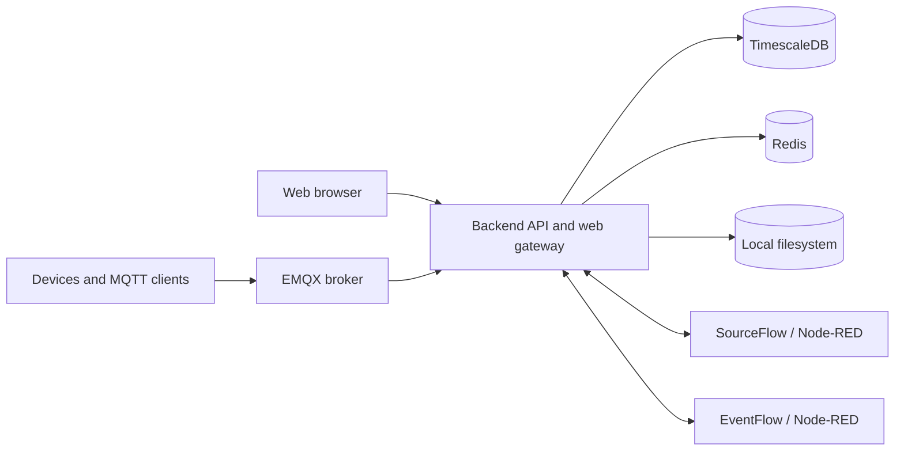

# Tier0 Edge

Tier0 Edge is an open-source industrial data platform for collecting, organizing, and serving edge data through UNS, Flow, MQTT, and HTTP APIs.

## Included capabilities

- Core UNS (permanent delete; no recycle bin)
- Source Flow and Event Flow (no versions or rollback)
- API Key with UNS and Flow scopes
- Local user and role management plus personal settings
- Anonymous MQTT transport
- Local filesystem storage only

## Architecture



| Component | Responsibility |
| --- | --- |
| `backend/` | Go API service, authentication, UNS, gateway, migrations, and built web assets |
| `frontend/` | Web application source |
| `deploy/` | Single-node Docker Compose templates and lifecycle scripts |
| TimescaleDB | Metadata and time-series persistence |
| Redis | Cache and runtime coordination |
| EMQX | Anonymous MQTT connectivity for local and external clients |
| SourceFlow / EventFlow | Node-RED based collection and event processing |
| Local filesystem | Files under `VOLUMES_PATH/backend/files` |

## Installation

### Prerequisites

- Linux, macOS, WSL, or Windows with a Bash-compatible shell
- Docker Engine or Docker Desktop with Docker Compose v2
- Network access to Docker Hub

### Install

```bash
git clone https://github.com/FREEZONEX/Tier0-Edge.git
cd Tier0-Edge/deploy
cp .env.default .env
# Edit .env before the first start (see the configuration table below).
bash bin/install.sh
```

The default backend image is `tier0/tier0-edge:3.0.0`; TimescaleDB, Redis, EMQX, and Node-RED also use public Docker Hub images. The installer generates internal runtime secrets, pulls the configured images, and starts the complete stack.

### Common `.env` settings

| Setting | Use | Example |
| --- | --- | --- |
| `VOLUMES_PATH` | Host directory that stores all persistent database, Flow, MQTT, and file data. Choose a durable disk before the first start. | `/srv/tier0/data` on Linux; `D:/tier0/data` or `/d/tier0/data` in Windows Bash |
| `ENTRANCE_DOMAIN` / `ENTRANCE_PORT` | Address and port used to open the platform. | `192.168.1.10` / `8088` |
| `ADMIN_INITIAL_PASSWORD` | Password for the initial `tier0` administrator. Change it before exposing the service. | A strong private password |
| `COMPOSE_PROJECT_NAME` / `PORT_OFFSET` | Isolate multiple instances running on the same host. | `edge_lab` / `100` |

`VOLUMES_PATH` is the most important setting: keep it stable for the lifetime of an instance. Back up that directory before uninstalling, relocating Docker, or performing destructive maintenance. Do not edit `deploy/.env.runtime`; it contains generated secrets and resolved runtime values.

### Access and verify

- Open `http://127.0.0.1:8088/uns` when using the defaults.
- Sign in with `tier0` / `tier0` when using the defaults.
- Check service health and readiness from `deploy/`:

```bash
bash bin/compose.sh ps
bash bin/compose.sh logs -f backend
curl -fsS http://127.0.0.1:8088/readyz
```
