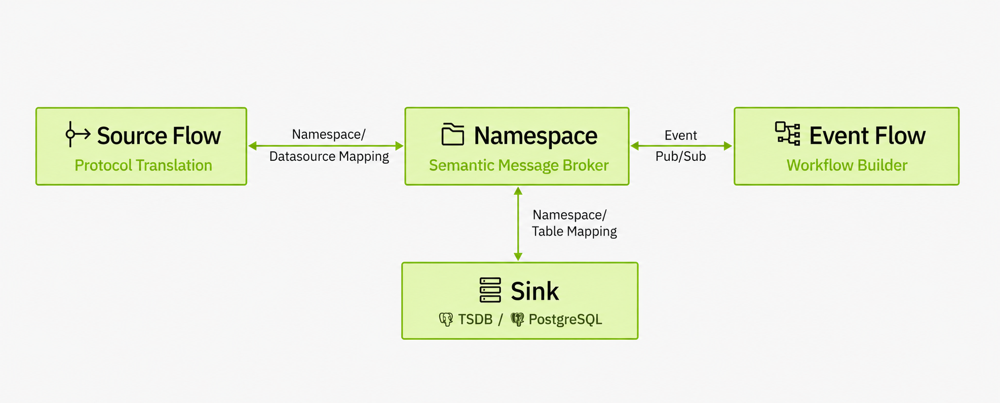

# TIER0: The Unified Namespace Software


[](https://tier0.app/trial)
[](https://tier0edge.vercel.app/)
[](./LICENSE)

**Tier0** is an open-source industrial data integration platform built on the **Unified Namespace (UNS)** methodology and powered by production-grade open-source technologies.


---

## Architecture Overview


- **Source Flow**  
  Serves as the connection pipeline to devices and systems. It handles real-time protocol translation into JSON payloads. Built entirely on Node-RED.
  
- **Namespace**<br/>
  The core of Tier0. A semantic MQTT broker and parser that models data using topic hierarchies and structured JSON payloads.

- **Sink**  
  The storage layer of Tier0.
  - Time-series Namespace values are stored in **TimescaleDB**.
  - Relational Namespace values (e.g., CRM data) are stored in **PostgreSQL**.  
    This enables efficient querying and compression.

- **Event Flow**  
  Orchestrates Namespaces into higher-level event/information flows. Supports merging JSON payloads and appending system-generated prompts for LLM-powered optimization.

---

## Hardware Requirements

|             | Minimum Requirement                  | Recommended Requirement                       |
|-------------|--------------------------------------|-----------------------------------------------|
| CPU         | 4 cores                              | 8 cores                                       |
| Memory      | 8 GB                                 | 16 GB                                         |
| Disk        | 100 GB, 1000 IOPS (30% random write)      | 1 TB, 2000 IOPS (30% random write)        |
| Browser     | Chrome 89, Edge 89, Firefox 89, Safari 15 | Chrome 89, Edge 89, Firefox 89, Safari 15 |

## Deployment
> For detailed guides and advanced examples, see the <a href="https://docs.tier0.app/">Tier0 Docs</a>.
### 1.Linux
#### 1.1 Operating Environment
- **Operating System**: Currently tested on Ubuntu Server 24.04 with Docker. We welcome feedback on other OS distributions.
- **Docker**: We assume you have Docker (with `docker compose` and `buildx`) installed. Our tested versions:
  - Docker Engine - Community: 27.4.0
  - Docker Buildx: v0.19.2
  - Docker Compose: v2.31.0
  - containerd: 1.7.24

#### 1.2 Installing Tier0
1. Clone the project.
   ```bash
   git clone <this repo>
   ```
2. Navigate to the `Tier0` directory and edit environment variables in the `.env` file.
   ```bash
   cd Tier0-Edge/deploy
   cp .env.default .env
   vi .env
   ```
3. Edit parameters as needed in the `.env` file.<br/>

| Field | Type | Description | Example |
|------|------|-------------|---------|
| VOLUMES_PATH | string | Storage path for project data | `/srv/tier0/data` on Linux; `D:/tier0/data` or `/d/tier0/data` in Windows Bash |
| ENTRANCE_DOMAIN/ENTRANCE_PORT | string | Tier0 access endpoint (IP/domain + port) | `192.168.1.10` / `8088` |
| LANGUAGE | enum | zh-CN / en-US | `en-US` |
| ADMIN_INIT_PASSWORD | string | Initial password for the admin user | A strong private password |
| COMPOSE_PROJECT_NAME/PORT_OFFSET | string | Isolate multiple instances running on the same host | `edge_lab` / `100` |

5. Install Tier0.
   ```bash
   bash bin/install.sh
   bash bin/compose.sh ps # Check the status of the containers
   bash bin/compose.sh logs -f backend # Check the logs of the backend container
   curl -fsS http://127.0.0.1:8088/readyz # Check the readiness of the backend service
   ```
### 2.Windows
#### 2.1 Operating Environment
- Install the latest version of **Docker Desktop** and **Git** on Windows 10 or Windows 11.
- It is recommended to perform all operations in **Git Bash** for better compatibility.
#### 2.2 Installing Tier0
1. Clone the project using **Git Bash**.
   ```bash
   git clone <this repo>
   ```
2. Navigate to the `Tier0` directory and edit environment variables in the `.env` file.
   ```bash
   cd Tier0-Edge/deploy
   cp .env.default .env
   vi .env
   ```
3. Edit parameters as needed in the `.env` file.
> See the table under **Linux**.

4. Install Tier0.
   ```bash
   bash bin/install.sh
   bash bin/compose.sh ps # Check the status of the containers
   bash bin/compose.sh logs -f backend # Check the logs of the backend container
   curl -fsS http://127.0.0.1:8088/readyz # Check the readiness of the backend service
   ```
### 3. Access the Platform
1. Visit `http://<YOUR-DOMAIN>:<YOUR-PORT>` in your browser (based on ENTRANCE_DOMAIN and ENTRANCE_PORT in `.env`).
2. Sign in to Tier0 with the default account `tier0` and password, which is either the value of `ADMIN_INIT_PASSWORD` in `.env` or `tier0` if not set.
---

## Important Startup Operations
### 1. UNS Data Model Creation
1. In **UNS**, send the template JSON from **Import** to an LLM, and use a similar prompt.
    ```
    Generate a UNS model used for xx in xx plant, including xx equipment and data sources based on the template.
    ```
2. Import the generated result in UNS.

### 2. Model Data Source Connection
> Connect real data to make models alive.
1. Use nodes based on the data source type to build a flow in **Source Flow**, and end it with an `mqtt out` node.
  Install nodes from Node-RED community for your requirements. Official nodes often start with `node-red-contrib`.

2. Make sure the **Server** of the `mqtt out` node is set to the UNS broker, and topic is a model from **UNS**.
  The UNS broker has the same name as that of the flow.
---

## License
This project is licensed under the [Apache 2.0 License](./LICENSE).

## Support & Contact
- 📖 [Documentation](https://docs.tier0.app)
- 🐞 [GitHub Issues](./issues)

## Contributors
We gratefully acknowledge the following individuals for their contributions to Tier0:

**Wenhao Yu**, **Liebo**, **Weipeng Dong**, **Kangxi**, **Lifang Sun**, **Minghe Zhuang**,  
**Wangji Xin**, **Fayue Zheng & Yue Yang**, **Yanqiu Liu**, **Dongdong An**, **Jianan Zhu**

