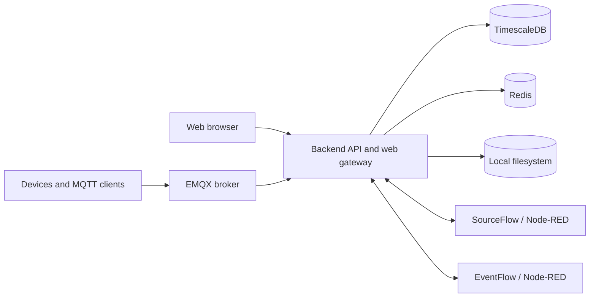

# Tier0 Edge

Tier0 Edge is an open-source industrial data platform for collecting, organizing, and serving edge data through UNS, Flow, MQTT, and HTTP APIs.

## Included capabilities

- Core UNS (permanent delete; no recycle bin)
- Source Flow and Event Flow (no versions or rollback)
- API Key with UNS and Flow scopes
- Local user and role management plus personal settings
- Anonymous MQTT transport
- Local filesystem storage only

## Architecture



| Component | Responsibility |
| --- | --- |
| `backend/` | Go API service, authentication, UNS, gateway, migrations, and built web assets |
| `frontend/` | Web application source |
| `deploy/` | Single-node Docker Compose templates and lifecycle scripts |
| TimescaleDB | Metadata and time-series persistence |
| Redis | Cache and runtime coordination |
| EMQX | Anonymous MQTT connectivity for local and external clients |
| SourceFlow / EventFlow | Node-RED based collection and event processing |
| Local filesystem | Files under `VOLUMES_PATH/backend/files` |

## Installation

### Prerequisites

- Linux, macOS, WSL, or Windows with a Bash-compatible shell
- Docker Engine or Docker Desktop with Docker Compose v2
- Network access to the container registries configured in `deploy/.env.default`

### Install with Docker Compose

```bash
git clone --branch feat-edge-new --single-branch https://github.com/FREEZONEX/Tier0-Edge.git
cd Tier0-Edge/deploy
bash bin/install.sh
```

The default backend image is `tier0/tier0-edge:3.0.0`. The installer creates `.env`, generates internal runtime secrets, pulls the configured images, and starts the complete stack. The development login is `tier0` / `tier0`. Resolved values are written to `deploy/.env.runtime`; keep that file private and do not edit it manually.

To customize ports, domains, storage, or the backend image before first startup:

```bash
cd deploy
cp .env.default .env
# Edit .env, then install.
bash bin/install.sh
```

All default runtime images are public Docker Hub images and can be pulled without Harbor credentials.

After installation:

- Open `http://127.0.0.1:8088/uns` when using the defaults.
- Sign in with `tier0` / `tier0` when using the defaults.
- Override `ADMIN_INITIAL_PASSWORD` in `deploy/.env` before exposing the service outside a trusted development network.
- Check readiness with `curl http://127.0.0.1:8088/readyz`.

### Verify an installed runtime

The public deployment ships a foundation regression for login, retained and removed APIs, settings navigation, Metric creation, Mock Flow deployment, anonymous MQTT, latest data, and history persistence. Install Node.js with `npx`, then run from `deploy/`:

```bash
bash bin/regression.sh
```

The wrapper reads the configured entrance, version, administrator name, and initial password from `.env` / `.env.runtime`. Override them without editing the script through `TIER0_REGRESSION_BASE_URL`, `TIER0_REGRESSION_USERNAME`, `OPEN_SOURCE_REGRESSION_PASSWORD`, or ordinary command arguments. In an isolated disposable installation only, set `TIER0_REGRESSION_FAULT_INJECTION=true` to stop SourceFlow temporarily and verify failed-create compensation plus an identical successful retry.

### Common operations

Run these commands from `deploy/`:

```bash
bash bin/compose.sh ps
bash bin/compose.sh logs -f backend
bash bin/compose.sh restart backend
bash bin/backup.sh
bash bin/restore.sh --from backups/<backup>.tar.gz
bash bin/uninstall.sh
```

Persistent data is stored under `VOLUMES_PATH`. Back up that directory and the generated deployment configuration before destructive maintenance.

### Build the backend image locally

To build instead of pulling the configured backend image, install Node.js and pnpm, set `BACKEND_IMAGE` in `deploy/.env` to a local tag such as `tier0-edge:local`, then run:

```bash
cd deploy
bash bin/build-images.sh
bash bin/install.sh
```
